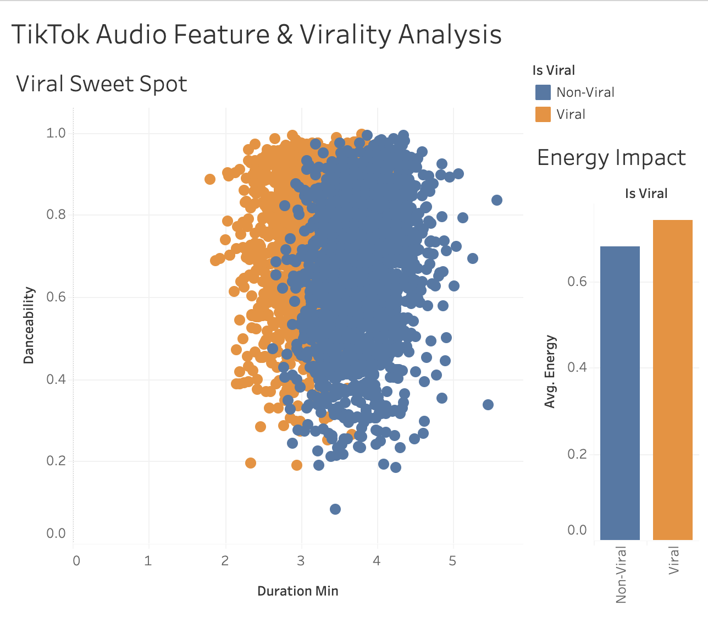

# TikTok Viral Song Predictor

### Executive Summary
Leveraging machine learning techniques, this project investigates the audio features that drive virality on TikTok. By analyzing a dataset of trending songs versus non-trending tracks, I utilized **Logistic Regression** in R to determine that shorter duration and high "danceability" scores are the strongest predictors of viral success.

### Tools Used
* **R (Caret, Random Forest):** Feature engineering and classification modeling.
* **SQL:** Feature extraction and data merging.
* **Tableau:** Visualization of audio feature correlations.

### Dashboard

### Key Files
* `tiktok_virality_analysis.Rmd`: The classification model and feature analysis.
* `tiktok_feature_engineering.sql`: SQL scripts for feature extraction.
